Documentation utilisateur
#########################

Utilisation de la solution
==========================

Cette documentation décrit en détail les différentes fonctionnalités apportées
par notre logiciel.

Fonctionnalités Communes
------------------------

Créer, Lister, Afficher, Modifier, Supprimer ses propres évènements.
~~~~~~~~~~~~~~~~~~~~~~~~~~~~~~~~~~~~~~~~~~~~~~~~~~~~~~~~~~~~~~~~~~~~~~~~

Il est possible de gérer ses évènements personnels. Pour cela il suffit, pour
l'ajout, de cliquer sur le calendrier, et pour la suppression et la
modification, de sélectionner l'évènement sur le calendrier, puis de renseigner
les champs qui apparaissent à l'écran.

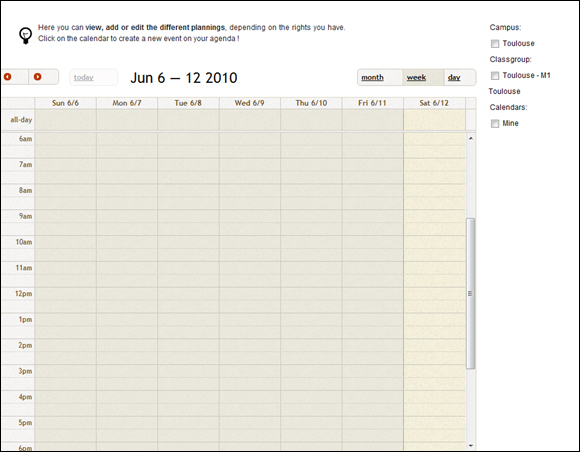
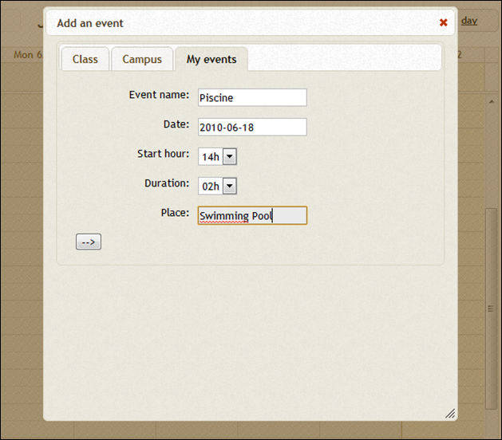
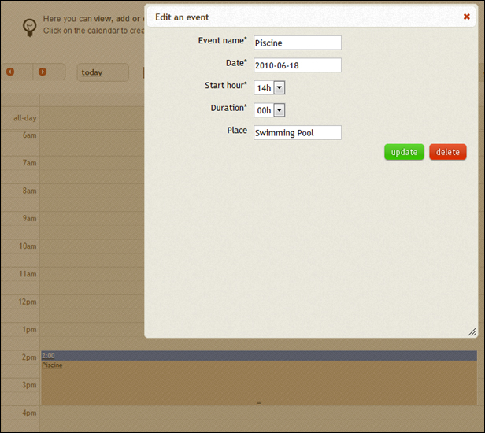

Lister et afficher les universités, les campus et les lieux
~~~~~~~~~~~~~~~~~~~~~~~~~~~~~~~~~~~~~~~~~~~~~~~~~~~~~~~~~~~~~

TimeTablEasy permet de visualiser les différents lieux, d'une manière
similaire. Il suffit pour cela d'utiliser le menu qui se situe en haut à droite
de chaque page, puis de sélectionner l'élément souhaité.

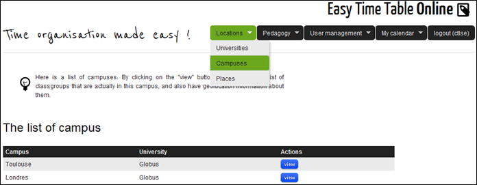
   
Lister et Afficher les Cursus, les périodes d'étude et les matières
~~~~~~~~~~~~~~~~~~~~~~~~~~~~~~~~~~~~~~~~~~~~~~~~~~~~~~~~~~~~~~~~~~~~

De la même manière, pour visualiser les éléments en relation avec ce que nous
appelons la "pédagogie", sélectionnez les éléments depuis le menu.

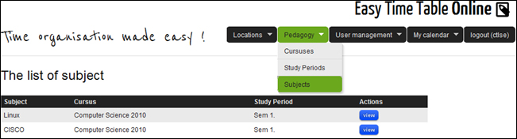
   
Lister et Afficher les classes, les étudiants, les dirrecteurs de campus et les intervenants
~~~~~~~~~~~~~~~~~~~~~~~~~~~~~~~~~~~~~~~~~~~~~~~~~~~~~~~~~~~~~~~~~~~~~~~~~~~~~~~~~~~~~~~~~~~~~

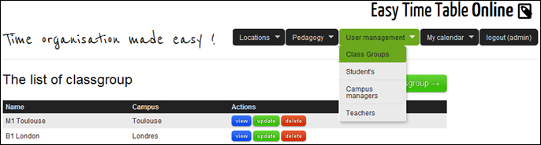

Lister les évènements de planning
~~~~~~~~~~~~~~~~~~~~~~~~~~~~~~~~~~

Il est possible de visualiser les évènements contenus dans un planning de trois
manières différentes :

    * via une liste "simple", des prochains évènements à venir
    * via le calendrier
    * via des données exportées au format iCal.

La liste simple constitue la version "mobile de notre application".

* Lister les prochains évènements

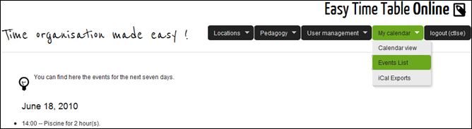
   
* Exporter son planning au format iCal.

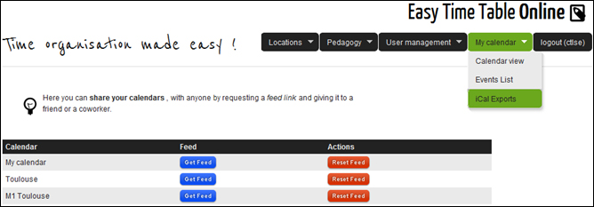

Se déconnecter.
~~~~~~~~~~~~~~~~

Si vous souhaitez vous déconnecter, utilisez le menu de droite.

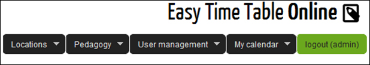

Autres fonctionnalités
------------------------

Lorsqu'un élément de `Lieux` est affiché (Université, Campus, Lieu), 
sa localisation géographique est également affichée sur une carte.

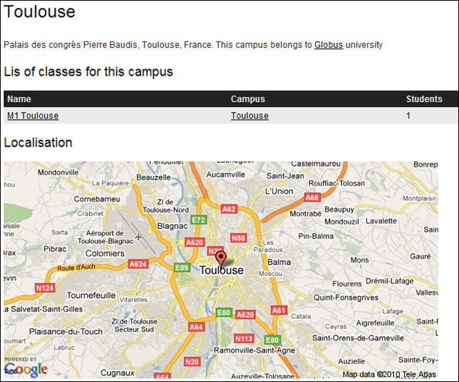

Lorsqu'une `Période d'étude` ou une `matière` sont affichés, il est possible de 
visualiser des graphiques mettant en valeur la répartition des contenus
pédagogiques (en camembert pour les matières, et en barres cumulées pour 
les périodes d'étude).

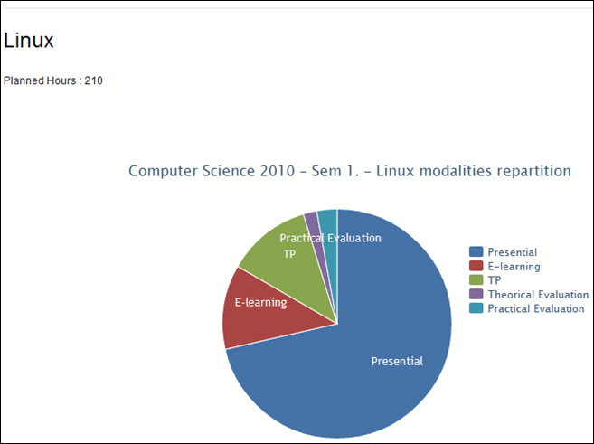

Niveaux de privilèges
---------------------

Utilisateur non authentifié
~~~~~~~~~~~~~~~~~~~~~~~~~~~~

Un utilisateur non authentifié a un accès en lecture sur l'ensemble des éléments
suivants. Il ne peut pas les modifier, ni les supprimer ou en ajouter:

* Les Universités

* Les Campus

* Les Places

* Les Cursus

* Les Périodes d'études

* Les Sujets

Il est bien sur également possible de s'authentifier.

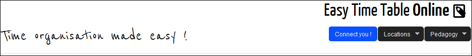

Élève
~~~~~~

Un élève a accès a son planning personnel, et est associé a une classe.
Il a donc accès aux fonctionnalités communes, et peut également visualiser le
planning de son campus et de sa classe.

Pour cela, il suffit de sélectionner les calendrier que l'on souhaite
visualiser, grâce au menu situé à droite du calendrier.

Intervenant
~~~~~~~~~~~~

Un intervenant est chargé de dispenser des cours.

Il gère son propre planning, mais il est aussi associé à des cours, ou à
d'autres évènements de plannings.

Campus Manager
~~~~~~~~~~~~~~

Un campus manager gère un campus, les lieux et les classes associés.

Il peut donc, en plus des fonctionnalités communes :

* Créer, lister, modifier, Supprimer

	* Les lieux associées à son campus.
	
	* Les classes
	
	* Les étudiants
	
	* Les intervenants

Administrateur
~~~~~~~~~~~~~~

L'administrateur peut Créer, Lister, Modifier ou Supprimer tous les éléments
de l'application sauf les évènements personnels d'autres utilisateurs.

Il ne peut effectuer aucune action concernant un évènement personnel d'un
autre utilisateur.
